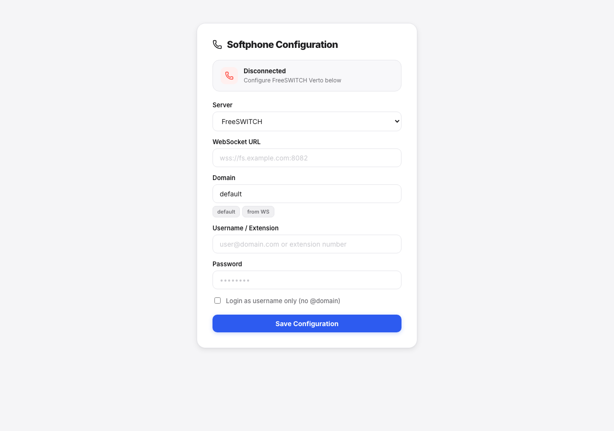

# softphone

[](https://github.com/thadeu/softphone/actions/workflows/ghcr.yml)
[](https://github.com/thadeu/softphone/releases)
[](https://github.com/thadeu/softphone/pkgs/container/softphone)

Browser softphone (React + Vite). Two signaling backends behind the same UI:

| Server (UI) | Protocol | Typical use |
|---|---|---|
| **FreeSWITCH** | Verto (`mod_verto`) | Outbound + inbound Verto |
| **Kamailio** | SIP over WebSocket (JsSIP) | Inbound INVITE (SBC / register dinâmico) |

Static SPA served by nginx in production (`ghcr.io/thadeu/softphone`).



## Requirements

- [Bun](https://bun.sh)
- FreeSWITCH with `mod_verto`, and/or Kamailio with WebSocket + digest auth (+ TURN/rtpengine as needed)
- Docker (optional)

## Quick start

```bash
make install
make dev
```

Open the app → choose **FreeSWITCH** or **Kamailio** → WebSocket URL, domain, username, password.

## Protocols

### FreeSWITCH (Verto)

- Signaling: JSON-RPC over WebSocket (`login`, `verto.invite`, `verto.answer`, `verto.bye`, `verto.info`)
- Example WSS: `wss://fs.example.com:8082`
- Auth failures often surface as `-32001` — check directory user/domain/password

### Kamailio (SIP / JsSIP)

Dynamic REGISTER with username + password (digest). WebSocket URL is **not hardcoded** — use `ws://` or `wss://` as your SBC exposes.

Example (Kamailio SBC):

| Field | Example |
|---|---|
| Server | Kamailio |
| WebSocket URL | `wss://yourserver.acme.com` (or `ws://host:8080` in lab) |
| Domain | `yourserver.acme.com` |
| Username | SIP user / AOR local part (e.g. `fullNumber`) |
| Password | digest password |
| SIP User-Agent | optional; Atende Kamailio expects `AS-webrtc` |

Behavior:

- `REGISTER` → binding no `usrloc`
- Inbound `INVITE` → ringing UI → **Answer** (`200`) or **Decline** (`488`)
- Active call hangup → SIP `BYE` / `terminate`
- ICE: STUN (Google/Twilio) + TURN `turn:{host}:80` udp/tcp (user/pass = login creds), aligned with auth voip-app
- `register_expires`: 15s

Outbound dialing in Kamailio mode uses JsSIP `INVITE` from the browser. Your production outbound is dialer-API → INVITE back to the agent; use **FreeSWITCH** for Verto outbound as today.

## Make targets

```bash
make install        # bun install
make dev            # vite --host
make build          # production build → dist/
make preview        # vite preview
make lint           # eslint
make test           # vitest run
make test-watch     # vitest watch
make start          # build + serve dist
make docker-build   # docker build ghcr.io/thadeu/softphone:latest
make docker-up      # compose up --build -d → :8080
make docker-down
make docker-logs
make docker-push
```

## Docker

```bash
make docker-up
# http://localhost:8080
```

Or pull the published image:

```bash
docker run --rm -p 8080:80 ghcr.io/thadeu/softphone:latest
```

Image: `ghcr.io/thadeu/softphone` (`linux/amd64` + `linux/arm64`)

CI builds and pushes multi-arch on tags `v*` (and `workflow_dispatch`). See `.github/workflows/ghcr.yml`.

## Tests

```bash
make test
# or
bun run test:watch
```

Unit tests cover domain helpers, SIP URI/ICE builders, and application use cases. E2E against FreeSWITCH/Kamailio is out of scope for Vitest.

## Voodu

```hcl
deployment "softphone" "web" {
  image = "ghcr.io/thadeu/softphone:latest"
  replicas = 1
}
```

Or keep Procfile/build mode and point ingress at the web process.

## Notes

- Page must be HTTPS (or localhost) for mic + secure WebSocket in production
- Protocol selection is a UI dropdown for now; env/feature-flag lock can come later without changing `SoftphonePort`
